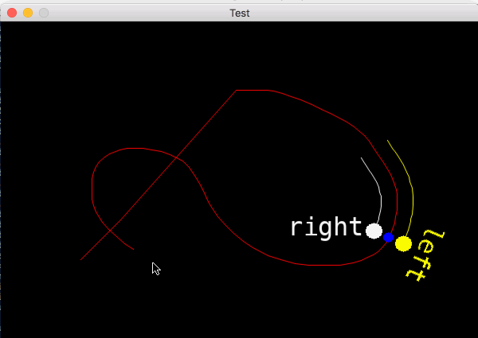

# Geo2D Visual Test

This is a visual test of the [Geo2D](https://github.com/jgoizueta/Geo2D) functions.

This was originally implemented using [ruby-procession](https://github.com/jashkenas/ruby-processing)
and I've adapted it to check out the new SDL-based [graphics](https://github.com/zenspider/graphics) gem.

The `test.rb` script must be executed with [`rsdl`](https://github.com/knu/rsdl) rather than `ruby`.

The test program will open a graphics windows in which a path can be drawn with the mouse,
which will be followed by the moving dots/labels:

Pressing the spacebar resets the path and pressing `q` exits the program.

It can be ran with the regular ruby interpreter but in that case some of the functionality is limited:
* `Mousemove` events are only received when moving with button pressed (and once at startup).
* `Keydown` are never received; it seems key presses are handled by the parent terminal.

This was written as a thorough test of `Geo2D` for the purporse it was created for:
draw symbols alined to lines and asign symbols to nearby lines.
